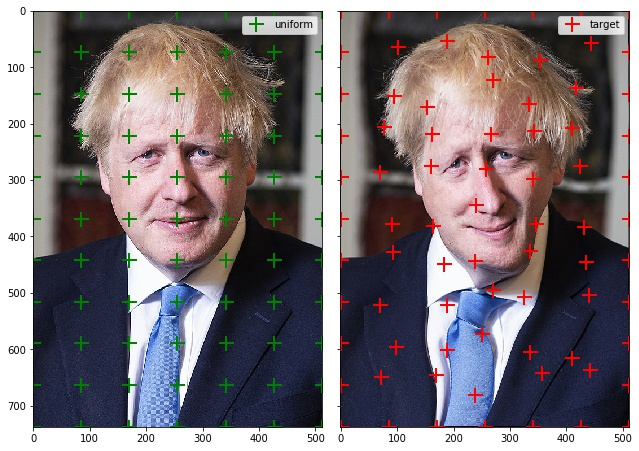

# Thin Plate Splines for PyTorch

Implementation of Thin-Plate-Splines (TPS) in PyTorch.

## Installation

    cd torch-tps
    pip install -e .

## Usage

there is an example included:

    python example.py

## Limitations

Batch processing not implemented yet.
